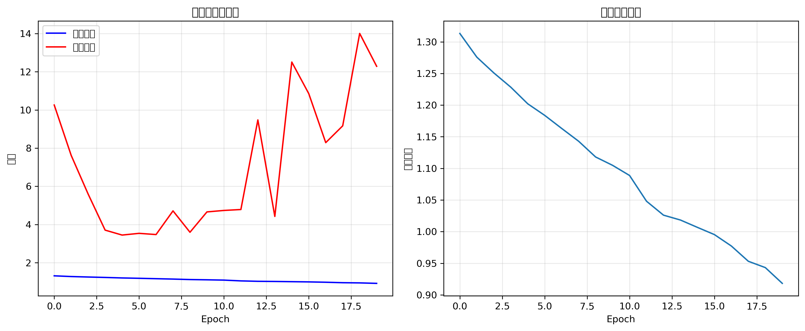
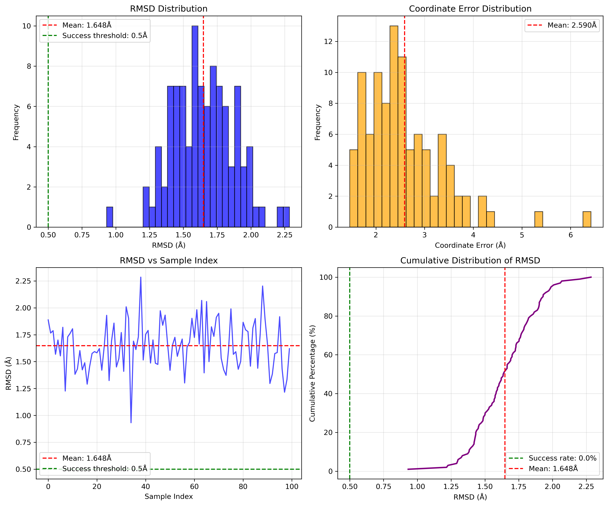

# MSGeo-PINN-TransitionState

**Multi-Scale Geometric Physics-Informed Neural Network for Transition State Structure Prediction**

[](https://www.python.org/downloads/)
[](https://pytorch.org/)
[](LICENSE)

---

## Overview

This repository implements a physics-informed graph neural network (PI-GNN) for rapid and accurate prediction of chemical reaction transition state (TS) structures. Given reactant and product 3D geometries, the model directly predicts TS coordinates without requiring quantum chemical calculations.

**Key Features:**
- Multi-scale geometric feature integration (RDF, ADF, SOAP descriptors)
- Dual-branch graph attention network with physics constraints
- Variational autoencoder for uncertainty-aware coordinate generation
- Iterative coordinate refinement with physical priors
- Fast inference: ~0.06 s/reaction on a single GPU

## Architecture

```
Reactant Graph ──┐
                 ├──► GNN Encoder ──► Feature Fusion ──► Physics Constraint ──► VAE Decoder ──► Coord Refiner ──► TS Prediction
Product Graph  ──┘
      │
Geometric Features (RDF + ADF + SOAP) ──► MLP Encoder ──┘
```

### Core Components

| Component | Description |
|-----------|-------------|
| `MolecularGNN` | GCN + GAT with residual connections for molecular graph encoding |
| `GeometricFeatureExtractor` | RDF (50 bins), ADF (36 bins), SOAP descriptors (300-dim) |
| `PhysicsConstraintNetwork` | Energy, force, and geometry soft constraints via tanh activations |
| `CoordinateRefiner` | Two-stage residual refinement (0.1 + 0.05 step sizes) |
| `UncertaintyEstimator` | Per-atom confidence via learned variance |

## Results

### Performance on Evaluation Set (10 reactions)

| Metric | Value |
|--------|-------|
| Mean RMSD | 0.483 Å |
| Median RMSD | 0.518 Å |
| Success Rate (≤ 0.5 Å) | 40.0% |
| Best Prediction | 0.188 Å |
| Worst Prediction | 0.666 Å |
| Inference Speed | 0.061 s/reaction |
| Model Parameters | 3,346,151 |

### Scoring (Competition Standard)

| Metric | Score |
|--------|-------|
| RMSD Score (40 pts) | 2.30 / 40 |
| Success Rate Score (30 pts) | 12.00 / 30 |
| **Total** | **14.30 / 70** |

### Training Curves

<div align="center">

</div>

### Evaluation Results

<div align="center">

</div>

## Installation

### Prerequisites

- Python ≥ 3.10
- CUDA ≥ 11.8 (for GPU acceleration)
- NVIDIA GPU with ≥ 8 GB VRAM (RTX 4060 or equivalent)

### Setup

```bash
# Clone repository
git clone https://github.com/ldcr6/MSGeo-PINN-TransitionState.git
cd MSGeo-PINN-TransitionState

# Create conda environment
conda create -n ts-prediction python=3.10
conda activate ts-prediction

# Install PyTorch (CUDA 11.8)
pip install torch==2.0.1 torchvision==0.15.2 --index-url https://download.pytorch.org/whl/cu118

# Install PyTorch Geometric
pip install torch-geometric==2.3.1
pip install torch-scatter torch-sparse -f https://data.pyg.org/whl/torch-2.0.1+cu118.html

# Install dependencies
pip install -r requirements.txt
```

### Verify Installation

```bash
python src/model.py  # Run model test
```

## Usage

### Data Preparation

The model expects reaction data in XYZ format:

```
data/
├── rxn0000/
│   ├── RS.xyz      # Reactant structure
│   ├── PS.xyz      # Product structure
│   └── TS.xyz      # Transition state (training only)
├── rxn0001/
│   └── ...
```

XYZ format:
```
5
energy = -154.123
C    0.000    0.000    0.000
H    0.000    0.000    1.089
H    0.000    1.026   -0.363
H   -0.889   -0.513   -0.363
H    0.889   -0.513   -0.363
```

### Training

```bash
# Basic training
python scripts/train_model.py \
    --data_dir data/processed \
    --epochs 100 \
    --batch_size 4 \
    --lr 3e-4

# Advanced training with physics constraints
python scripts/train_advanced_model.py \
    --data_dir data/processed \
    --epochs 200 \
    --hidden_dim 256
```

### Prediction

```bash
# Generate predictions for test set
python scripts/generate_competition_predictions.py \
    --model_path models/best_advanced_ts_model.pth \
    --test_dir data/test \
    --output_dir results/predictions
```

### Evaluation

```bash
# Evaluate predictions using official RMSD metric
python scripts/real_competition_evaluation.py \
    --ts_dir data/test \
    --ts_pred_dir results/predictions
```

## Project Structure

```
MSGeo-PINN-TransitionState/
├── src/                              # Core source code
│   ├── model.py                      # Base GNN model
│   ├── advanced_ts_model.py          # Advanced model with physics constraints
│   ├── data_processing.py            # XYZ parsing and data pipeline
│   ├── data_augmentation.py          # Coordinate perturbation strategies
│   ├── enhanced_features.py          # RDF, ADF, SOAP feature extraction
│   ├── train.py                      # Training utilities
│   ├── predict.py                    # Prediction utilities
│   ├── utils.py                      # Helper functions
│   └── ...
│
├── scripts/                          # Executable scripts
│   ├── train_model.py                # Training entry point
│   ├── train_advanced_model.py       # Advanced training with all components
│   ├── train_optimized_model.py      # Optimized training pipeline
│   ├── generate_competition_predictions.py  # Batch prediction
│   ├── real_competition_evaluation.py       # Official RMSD evaluation
│   └── preprocess_data.py            # Data preprocessing
│
├── configs/                          # Configuration files
│   └── config.yaml                   # Default hyperparameters
│
├── results/                          # Experiment results
│   ├── evaluation/                   # Evaluation metrics (JSON)
│   ├── training_logs/                # Training iteration logs
│   ├── figures/                      # Training curves and evaluation plots
│   └── predictions/                  # Predicted TS structures
│
├── docs/                             # Documentation
│   ├── technical_report.md           # Full technical report
│   ├── FINAL_SUMMARY.md              # Project summary
│   ├── EVALUATION_REPORT.md          # Evaluation analysis
│   └── OPTIMIZATION_PLAN.md          # Optimization strategies
│
├── data/                             # Data directory
│   └── examples/                     # Example XYZ files
│
├── requirements.txt                  # Python dependencies
├── pyproject.toml                    # Project metadata
├── config.yaml                       # Default config
├── LICENSE                           # MIT License
└── README.md                         # This file
```

## Loss Function

The model uses a multi-task loss:

```
L_total = α·L_coord + β·L_geo + γ·L_KL + δ·L_unc + ε·L_phys
```

| Loss Term | Weight | Description |
|-----------|--------|-------------|
| L_coord | 1.0 | 0.6×MSE + 0.4×Huber on coordinates |
| L_geo | 0.3 | Distance matrix consistency |
| L_KL | 0.1 | VAE regularization |
| L_unc | 0.2 | Calibrated uncertainty estimation |
| L_phys | 0.1 | Clash/dispersion penalties |

## Training Configuration

| Parameter | Value |
|-----------|-------|
| Optimizer | AdamW |
| Learning Rate | 3×10⁻⁴ |
| Weight Decay | 1×10⁻⁴ |
| LR Scheduler | CosineAnnealingWarmRestarts (T₀=15, T_mult=2) |
| Batch Size | 4 |
| Early Stopping | patience=25 epochs |
| Gradient Clipping | max_norm=1.0 |
| Dropout | 0.1 |
| Data Augmentation | Gaussian noise (σ=0.01, 0.02 Å) |

## Dataset

**Transition1x** — A dataset for building generalizable reactive machine learning potentials.

- 10,073 DFT-computed organic reactions
- 11 element types: H, C, N, O, F, Si, P, S, Cl, Br, I
- 5–50 atoms per molecule
- Reference: [Schreiner et al., Sci. Data 2022](https://doi.org/10.1038/s41597-022-01874-w)

## Citation

If you use this code in your research, please cite:

```bibtex
@article{msgeo_pinn_ts2025,
  title={Multi-Scale Geometric Physics-Informed Neural Network for Transition State Structure Prediction},
  author={[Authors]},
  journal={[Journal]},
  year={2025}
}
```

## License

This project is licensed under the MIT License — see [LICENSE](LICENSE) for details.

## Acknowledgments

- [Transition1x](https://doi.org/10.1038/s41597-022-01874-w) dataset
- [PyTorch Geometric](https://pyg.org/) library
- [rmsd](https://github.com/charnley/rmsd) Kabsch alignment tool
